  <picture>
    <source media="(max-width: 600px)" srcset="assets/hero-mobile.svg">
    
  </picture>

 

## Hey, I'm Sorted

I run **Storm Development** and build software for game communities and Windows. I also work on OSINT tools, self-hosted services, and hardware projects.

 

<a href="https://github.com/Sorted1">
  <picture>
    <source media="(max-width: 600px)" srcset="assets/profile-mobile.svg">
    
  </picture>
</a>

 
 

<!-- projects:start -->
## Storm Development

Storm Scanner is my anti-cheat and digital forensics project; Storm Opti is for Windows optimization.

<a href="https://stormss.cc">
  <picture>
    <source media="(max-width: 600px)" srcset="assets/storm-scanner-mobile.svg">
    
  </picture>
</a>

<a href="https://stormopti.com">
  <picture>
    <source media="(max-width: 600px)" srcset="assets/storm-opti-mobile.svg">
    
  </picture>
</a>

## Other work

A few public projects, plus a Flipper Zero collection I curate.

<a href="https://github.com/Sorted1/Watson">
  <picture>
    <source media="(max-width: 600px)" srcset="assets/watson-mobile.svg">
    
  </picture>
</a>

<a href="https://github.com/Sorted1/Refresh-Rate-Switcher">
  <picture>
    <source media="(max-width: 600px)" srcset="assets/refresh-rate-switcher-mobile.svg">
    
  </picture>
</a>

<a href="https://github.com/Sorted1/ImageHost">
  <picture>
    <source media="(max-width: 600px)" srcset="assets/imagehost-mobile.svg">
    
  </picture>
</a>

<a href="https://github.com/Sorted1/FlipperStuff">
  <picture>
    <source media="(max-width: 600px)" srcset="assets/flipperstuff-mobile.svg">
    
  </picture>
</a>
<!-- projects:end -->

 

## Community

I also contribute to [BitHaven Buffalo](https://github.com/BitHavenLLC), a hackerspace in Buffalo, New York.

 

  <a href="https://github.com/Sorted1?tab=repositories">repos</a> &nbsp;·&nbsp;
  <a href="https://github.com/BitHavenLLC">bithaven</a> &nbsp;·&nbsp;
  <a href="https://x.com/Sorted1416">x</a> &nbsp;·&nbsp;
  <a href="https://t.me/Enervating">telegram</a>

